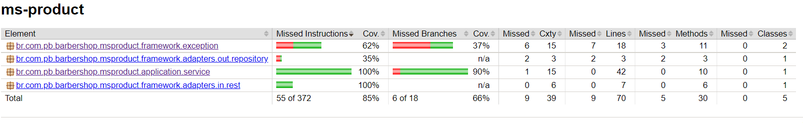
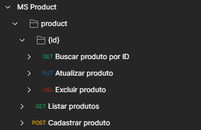

# MS Product


- URL: http://localhost:8084/api/barbershop/product
- [Swagger - OpenAPI](https://github.com/pbBarbershop/ms-user/blob/master/src/main/resources/openapi.yaml)
- MySQL Workbench
- [Dockerfile](https://github.com/pbBarbershop/ms-product/blob/master/Dockerfile)





## Exemplo de cURL

### POST - Cadastrar Produto

`/product`

```cURL
curl --location --request POST 'http://localhost:8084/api/barbershop/product' \
--header 'Content-Type: application/json' \
--header 'Accept: application/json' \
--data-raw '{
  "name": "velit sint",
  "quantity": -66816096,
  "value": -13217667.837559283,
  "id": -39222913,
  "description": "est proident"
}'
```

### GET - Listar Produtos

`/product?name=eu aliquip occaecat&page=15953878&size=5233786&sort=["enim in deserunt","deserunt"]`

```cURL
curl --location -g --request GET 'http://localhost:8084/api/barbershop/product?name=eu aliquip occaecat&page=15953878&size=5233786&sort=["enim in deserunt","deserunt"]' \
--header 'Accept: application/json'
```

### GET - Listar Produto

`/product/:id`

```cURL
curl --location --request GET 'http://localhost:8084/api/barbershop/product/-67350000' \
--header 'Accept: application/json'
```

### PUT - Atualizar Produto

`/product/:id`

```cURL
curl --location --request PUT 'http://localhost:8084/api/barbershop/product/-67350000' \
--header 'Content-Type: application/json' \
--header 'Accept: application/json' \
--data-raw '{
  "name": "velit sint",
  "quantity": -66816096,
  "value": -13217667.837559283,
  "id": -39222913,
  "description": "est proident"
}'
```
